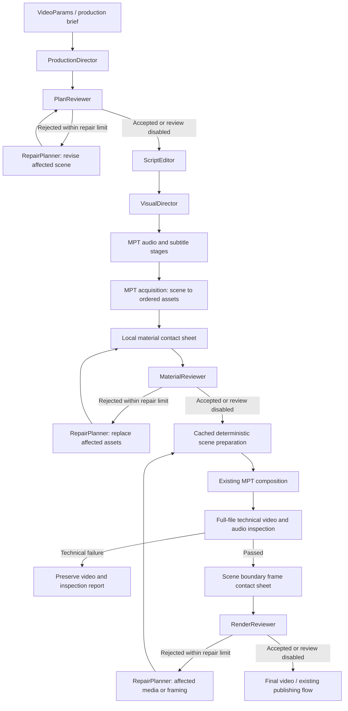

# Codex Production Intelligence

MoneyPrinterTurbo can use Codex to plan, edit and review a production while its
existing services continue to synthesize speech, build subtitles, acquire media,
compose video and manage tasks. Legacy is the default and existing providers
remain available.



## Subscription authentication

The intelligence runtime uses the official **`openai-codex==0.147.0` Python SDK**
and its pinned Codex executable. It does not call the OpenAI Python API. See the
[official Codex SDK documentation](https://learn.chatgpt.com/docs/codex-sdk) and
[Codex authentication documentation](https://developers.openai.com/codex/auth/).

The runtime requires an SDK account whose authentication type is `chatgpt`
before starting a model turn. It reuses the user's Codex login and OS credential
store. It never copies credentials into task directories. Missing or API-only
authentication produces `failed_stage: codex_auth` with a local login instruction.

The SDK's environment argument merges with the parent environment. Consequently,
MPT uses a small child launcher that removes `OPENAI_*`, `CODEX_API_KEY` and
conflicting provider variables **inside the child only**. Existing MPT providers
retain their original environment. The child also forces ChatGPT authentication,
the official OpenAI provider and official endpoints. Inference runs in a neutral
temporary directory with read-only sandboxing, denied approvals and disabled
production tools. Task images are passed using SDK `LocalImageInput`.
Resolved inherited MCP servers are individually disabled; an empty configuration
table alone would merge with user settings. The subscription runtime pins the
official ChatGPT Codex endpoint, so a configured API gateway cannot redirect a
ChatGPT token. Account checks time out after 45 seconds and model turns after
600 seconds; timed-out SDK processes are terminated.

`CODEX_HOME` remains available so an existing custom Codex credential location
continues to work. Sign in as the same operating-system user that runs MPT. A
container or remote server needs its own accessible Codex login; a host keychain
is not automatically available inside a container. Do not set `OPENAI_API_KEY`
or `CODEX_API_KEY` for this path. If a legacy provider needs them, keep them:
the child isolation ensures they cannot silently select API billing for Codex.

## Local setup

Run these commands from the checkout, using Python 3.11 or later and FFmpeg:

```bash
cd /Users/malickdes/AIWORKSPACE/MoneyPrinterTurbo
uv sync --frozen
uv run python -m app.intelligence.runtime login
uv run python -m app.intelligence.runtime status
```

The stable SDK bundles a pinned CLI. If your configured model requires a newer
Codex release, select an existing current Codex executable explicitly; the Python
SDK still drives it. For this macOS checkout the installed app executable is:

```bash
export MPT_CODEX_BIN="/Applications/ChatGPT.app/Contents/Resources/codex"
```

Set this in the terminal that launches the WebUI/API, then repeat `status`.
Other installations can use an absolute path to their current official Codex
CLI. An invalid override fails rather than silently falling back. MPT never
substitutes a different model when a runtime is too old.

The login command launches the selected executable (the SDK bundle by default,
or `MPT_CODEX_BIN` when set) and forces the ChatGPT
flow. Complete sign-in in your browser. On a machine without a local browser:

```bash
uv run python -m app.intelligence.runtime login --device-auth
```

Start the WebUI:

```bash
uv run streamlit run webui/Main.py --server.address 127.0.0.1 --server.port 8501
```

Start the API in a separate terminal:

```bash
uv run uvicorn app.asgi:app --host 127.0.0.1 --port 8080
```

The WebUI is at `http://127.0.0.1:8501`; API documentation is at
`http://127.0.0.1:8080/docs`.

## Enable planning and reviews

In the WebUI's script settings, expand **Production Intelligence** and select
**Codex**. The controls show authentication status, a refresh action, exact login
commands, optional model, reasoning effort, three review toggles, the quality
threshold and the repair limit. Leave the model blank to use Codex's current
configured default. No API key or base URL is accepted for Codex.

These settings are also fields on `VideoParams`, `TaskVideoRequest` and CLI batch
manifests. Set defaults under `[app]` in `config.toml`, or send explicit request
values. Explicit request values override configured defaults.

```toml
[app]
production_intelligence = "codex"  # "legacy" keeps the original pipeline
codex_model_name = ""
codex_reasoning_effort = "medium"
codex_review_enabled = true
codex_material_review_enabled = true
codex_render_review_enabled = true
codex_quality_threshold = 8.5
codex_max_repair_passes = 2
```

The repair limit applies to each review stage: one initial review and at most
`codex_max_repair_passes` repairs followed by reviews. Zero means evaluate once
without repair. Values are validated from 0 to 10. A pass requires approval, a
score at or above the threshold, and no error-severity issues. Exhaustion fails
the relevant review stage; it does not quietly label a rejected production as
successful. Review toggles deliberately bypass that quality gate and record
`status: disabled` in the corresponding artifact. Full-file technical media
inspection remains active even when the final Codex visual review is disabled.
If script editing or visual direction changes an approved plan, the changed plan
is reviewed again before audio generation using the same plan repair budget.

CLI example that stops before any speech or media provider is called:

```bash
uv run python cli.py --video-subject "Why leaves change color" \
  --production-intelligence codex --codex-reasoning-effort medium --stop-at script
```

For a complete video, omit `--stop-at script` and configure the selected media
and speech sources. All three toggles have CLI pairs such as
`--codex-render-review-enabled` / `--no-codex-render-review-enabled`.

Example body for `POST /api/v1/videos`:

```json
{
  "video_subject": "Why leaves change color",
  "production_intelligence": "codex",
  "codex_model_name": "",
  "codex_reasoning_effort": "medium",
  "codex_review_enabled": true,
  "codex_material_review_enabled": true,
  "codex_render_review_enabled": true,
  "codex_quality_threshold": 8.5,
  "codex_max_repair_passes": 2,
  "video_source": "pexels",
  "voice_name": "en-US-JennyNeural-Female"
}
```

### Codex as a generic LLM provider

Select **Codex (ChatGPT subscription)** in the LLM provider settings, or set
`llm_provider = "codex"` under `[app]`. This uses the same runtime for ordinary
MPT script generation, rewriting, search terms and social metadata. This provider
selection is independent of `production_intelligence`: planning mode can be
enabled while a different provider remains selected for other text operations.

## Media capabilities and third-party keys

The plan contracts represent `stock_video`, `ai_video`, `ai_image`, `local_asset`,
`diagram`, `chart`, `screenshot`, `text_card`, and `icon_composition`. Execution
uses capabilities of the selected MPT source:

| Visual type | Current scene execution |
| --- | --- |
| stock_video | Pexels, Pixabay, Coverr |
| ai_video | WaveSpeed, VolcEngine Seedance, OFox, Metaso MiniMax |
| ai_image | Existing OpenAI image source |
| local_asset | Existing local upload/preprocessing pipeline |
| diagram, chart, text_card, icon_composition | Built-in deterministic local image rendering, no media API key |
| screenshot | Built-in layout using an optionally uploaded screenshot image |

Select **Built-in visuals (no API key)** with **Production Intelligence → Codex**.
The planner supplies a validated `builtin_visual` specification for each scene.
Diagrams use nodes and edges; charts use labeled finite values with a source
description; cards use title/body; compositions use an allowlist of icons.
Charts must use supplied factual data, not invented statistics. Screenshot scenes
reference an index into uploaded local images. Screenshots are not autonomous
web browsing or fabricated captures; without an uploaded image that capability
is omitted from the brief. No model-written code, HTML, URLs or filesystem paths
are executed. Rendered images and prepared scenes are cached by their content.

CLI example using built-in visuals and intentional silence:

```bash
uv run python cli.py --video-subject "Coffee from plant to cup" \
  --production-intelligence codex --video-source builtin --voice-name no-voice \
  --bgm-type none --no-subtitle-enabled
```

LoomLoom's confirmed batch flow remains available in Legacy mode. Codex mode
does not silently transform a confirmed batch quote into new per-scene orders.
Visual modality changes are constrained to capabilities of the selected source.

Stock services and paid image/video/TTS/music/publishing services retain their
existing credentials and authorization rules. The OpenAI image provider still
uses its existing API credentials and billing; a Codex subscription does not
replace those. Edge TTS and local media retain their existing behavior. Automated
tests and the offline smoke command do not call paid external media services.

## Artifacts and targeted repair

Files live beside the existing `script`, `terms`, `audio`, `subtitle`, `materials`
and `video` stage outputs in `storage/tasks/<task-id>/`:

| File | Purpose |
| --- | --- |
| production-brief.json | Validated request, selected source and execution capabilities |
| production-plan.json | Final current scene narration, visual intent, timing, text, transition and continuity |
| visual-plan.json | Structured visual direction |
| production-review.json | Latest plan review or disabled/pending status |
| material-review.json | Latest material QA or disabled/pending status |
| render-review.json | Aggregate QA across every output video |
| media-inspection.json | First output's latest full-file technical inspection, metrics and coverage |
| media-inspection-video-*-pass-*.json | Technical evidence for each output and review pass |
| builtin-visuals/ | Cached locally rendered diagrams, charts, cards, icons and screenshot layouts |
| repair-history.json | Ordered, bounded scene repair decisions |
| materials-contact-sheet.jpg | First-page preview of labeled asset evidence |
| render-contact-sheet.jpg | First-page preview of the first output's scene start/middle/end frames |
| *.pages.json | Manifest of all ordered contact-sheet pages for the current generation |
| *-page-*.jpg | Aspect-aware evidence pages, all supplied to the corresponding reviewer |
| scene-materials.json | Explicit scene-to-asset mapping |
| scene-timeline.json | Actual selected scene boundaries and the alignment method |
| scene-clips/ | Cached normalized clips keyed by source files and rendering decisions |
| *-pass-*.json | Review history for each quality pass/output |
| *-before-repair-*.mp4 | Preserved render before a repair attempt |
| render-backups.json | Usable final-video backup paths from a render repair |

Scene IDs remain stable. Rejected materials are replaced by scene; accepted
materials, speech and subtitles are retained. Prepared scene clips are reused
when their source files and rendering decisions are unchanged. Local replacement
needs another supplied asset. Search replacement must return a new usable asset;
it fails clearly when no alternative exists. Render repairs preserve prior videos
before recomposition. Final assembly may need to run again, but planning, audio,
subtitles and accepted normalized scenes are not regenerated.
Built-in repairs use `revise_visual` with a changed complete visual specification;
only the rejected scene's image is replaced. Narration remains frozen.

Every Codex-mode final video receives a full-file FFmpeg decode and technical scan
of its primary video/audio streams, with completion recorded in coverage flags. Inspection
records black/freeze intervals, audio presence and duration, silence and signal
levels, and comparison with the narration reference when available. Planned static
visuals and intentional silence are accounted for. Decode/stream failures stop the
run with its files preserved; warnings accompany the visual review. These checks
detect technical defects, not spoken meaning or every perceptual problem.

Scene duration is aligned to matching narration subtitles where possible;
otherwise target durations are proportionally scaled to the audio length. The
timeline artifact records which method was used. Cumulative boundaries are
aligned to output frames to prevent rounding drift across many short scenes.
Local preparation trims/loops
assets to those durations, adds short on-screen captions, and applies `cut` or
`fade` transitions before the existing sequential compositor. Continuity text
guides asset selection and QA; it is not an arbitrary executable instruction.

## Tests and smoke checks

```bash
uv run python -m pytest -q test/services/test_codex_runtime.py \
  test/services/test_codex_provider.py test/services/test_codex_settings.py \
  test/services/test_webui_codex.py test/services/test_intelligence_media.py \
  test/services/test_intelligence_pipeline.py test/services/test_intelligence_audit.py \
  test/services/test_builtin_visuals.py test/services/test_builtin_settings.py \
  test/services/test_intelligence_builtin_pipeline.py test/services/test_media_qa.py \
  test/services/test_webui_builtin_visuals.py
uv run python -m pytest -q test
uv run ruff check app cli.py main.py webui test
uv run python -m app.intelligence.smoke --offline
```

The offline smoke creates temporary local images and silent audio, validates
WebUI-shared settings, constructs CLI parameters and an actual FastAPI request,
and produces small real videos through both Codex-mode and Legacy pipelines.
Codex decisions are mocked; FFmpeg, local preprocessing, composition and evidence
sheets are real. No ChatGPT account or media-provider key is needed.

After signing in, explicitly test one real subscription turn with JSON Schema
and a local image:

```bash
uv run python -m app.intelligence.smoke --live
```

This consumes normal Codex subscription usage. It does not generate paid external
AI video, call TTS, or publish anything. Optional `--model` selects an available
Codex model; omit it to preserve the configured default.

## Troubleshooting and limits

- **codex_auth:** Run the local login command as the MPT user, then `status`.
  API-key-only login is deliberately rejected. Check `CODEX_HOME` when using a
  custom credential store.
- **production_plan / visual_plan:** Check model availability, source capability
  and schema validation. Select Built-in visuals for diagrams, charts, cards and
  icons; upload an image to enable screenshot scenes.
- **plan_review / material_review / render_review:** Inspect the corresponding
  JSON and contact sheet. A rejected review after the repair limit is a quality
  failure. A transport or malformed-output failure is reported separately in
  the task error. Existing usable output files remain available.
- **repair:** Supply alternate local assets or a more useful stock query. Repairs
  cannot change narration after audio generation or invent unsupported providers.
- **FFmpeg/font errors:** Install FFmpeg or use MPT's configured FFmpeg path. Use
  an installed font for on-screen text. Unreadable media is shown as an error tile
  in a contact sheet instead of silently being omitted.
- **Subscription limits/network failures:** Retry after resolving sign-in,
  connectivity or usage limits. MPT never switches to API billing.
- **Model requires a newer runtime:** Update the SDK when a compatible release is
  available, or set `MPT_CODEX_BIN` to an installed current official Codex CLI.
  You may also explicitly choose an available compatible model in the WebUI.
  Blank model selection continues to request your Codex default.

Codex visual reviews inspect sampled still frames, supplemented by full-file
technical video/audio scans. Neither establishes perfect speech synchronization
or a complete semantic audiovisual review. Timing without matching subtitles
is an estimate, and AI review is not a factual verification service. Repair reuse
is within the current production run; restarting the same task is not a general
checkpoint-resume API. Use preserved files and reports to inspect failed runs.
